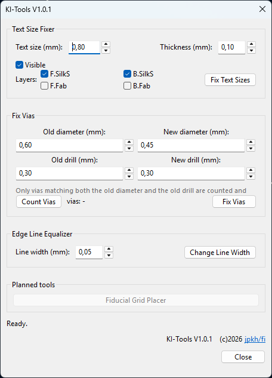

# KI-Tools

A KiCad PCB editor plugin with a collection of small board-editing utilities
behind a simple UI of buttons and text boxes. All tool values are remembered
between sessions.

## Tools

### Text Size Fixer

Sets footprint reference and value texts on the selected layers to the same
size, thickness and visibility in one go:

- **Text size** — text height in mm
- **Thickness** — text stroke width in mm
- **Visible** — show or hide the text items
- **Layers** — top/bottom silkscreen (`F.SilkS`, `B.SilkS`) and top/bottom
  fabrication (`F.Fab`, `B.Fab`)

Texts on fiducial / mounting-hole / tooling footprints, references like
`G201` or `FIDORIG1` and values like `LOGO` are hidden automatically.

### Fix Vias

Counts vias matching a given old diameter and drill, and resizes them to a
new diameter and drill in one go.

### Edge Line Equalizer

Sets the outline width of every drawing shape on the `Edge.Cuts` layer —
lines, arcs, rectangles, circles and polygons — to one value.

### Planned

- **Fiducial Grid Placer** — place fiducials on a grid

## Installation

Via the KiCad Plugin and Content Manager (PCM) once published, or manually:
copy the package's `plugins/` folder contents into your KiCad scripting
plugins folder.

## Development status

1.0.1 (testing). Three tools implemented; more planned.

## License

GPL-3.0 — see LICENSE.
